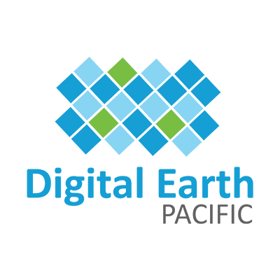

# Digital Earth Pacific (DEP) Data Access Documentation
<!--  -->
<div align="center">
  
</div>

Documentation of Digital Earth Pacific data organisation and access mechanisms via AWS Open Data Program.

## Data Organisation

Digital Earth Pacific's earth observation derived products are made accessible via the following integration services:

- **Spatial Temporal Asset Catalog (STAC)** specification was designed to establish a standard, unified language to talk about geospatial data, allowing it to more easily searchable and queryable. An overarching goal in having this common standard is to eliminate the need to puruse through APIs of many satellite providers in order to access all the needed data.

- **OGC Webservices (WMS, WFS, WCS)** defines web service standards for accessing and utilizing geospatial data online. These standards, known as OGC Web Services (OWS), ensure interoperability between different software and platforms. 

| Product Type                    | Data Format | Service               |
| ------------------------------- | ----------- | --------------------- |
| Cloud Optimised GeoTiffs (COGs) | Raster      | STAC, WMS, WMTS,  WCS |
| Coastlines Multi-Year PolyLines | Vector      | WMTS, XYZ             |

### Data Descriptions ###

>The data service URLs in this document will change in the near future, please refer back here for updated links and information.

STAC item records for the following COG products are available at [DEP STAC Catalog Browser](https://stac-browser.prod.digitalearthpacific.io).

The includes data descriptions for the following DEP products:

| Product                              | Temporal Scale | STAC Collection Name |
| ------------------------------------ | -------------- | -------------------- |
| Water Observations from Space (WoFS) | 2013-2021      | dep_ls_wofs          |
| Mangroves Extent and Density         | 2017-202       | dep_s2_mangroves     |
| Sentinel-2 GeoMAD                    | 2017-2024      | dep_s2_geomad        |
| Sentinel 1 GeoMAD                    | 2017-2023      | dep_s1_geomad        |

The DEP Coastlines Product from 2000-2023 is available via WFS and WMS services via [DEP Tileserver](https://tileserver.prod.digitalearthpacific.io/).

## Data Access Tutorials

### File access

Direct access to data is available through our [data browser](https://data.digitalearthpacific.org/) or via
the AWS CLI from the bucket at `s3://dep-public-data`, which is hosted in the `us-west-2` zone on AWS.

### Jupyter, Python and PySTAC-Client

STAC data items can be queried, visualised and/or downloaded using PySTAC-Client API within the [DEP Analytical Hub](https://hub.digitalearthpacific.org/) or local Python/Jupyter environment.

The full STAC API for Digital Earth Pacific is accessible at [DEP STAC API](https://stac.digitalearthpacific.org).

Below is an example for querying, plotting and downloading **DEP Managroves Extent and Density** product at a particular area of interest across all years.

```
from pystac.client import Client
from odc.stac import load

catalog = "https://stac.digitalearthpacific.org"  # DE Pacific STAC Catalog
collection = "dep_s2_mangroves"  # Collection for mangroves

# Define Coordinates, in lat, lon
lower_left = (-10.590125, 149.844629)
upper_right = (-10.360110, 150.195631)

bbox = (lower_left[1], lower_left[0], upper_right[1], upper_right[0])

# Find STAC Items
client = Client.open(catalog)
items = client.search(collections=[collection], bbox=bbox).item_collection()
print(f"Found {len(items)} items")

# Load STAC Items
data = load(items, bbox=bbox, bands=["mangroves"], chunks={})

# Plot Mangroves
data.mangroves.plot.imshow(
    col="time",
    col_wrap=4,
    levels=[0, 1, 2, 3],
    colors=["white", "yellow", "green", "darkgreen"],
)

# Save Mangroves as COG Tiles
for time in data.time.values:
    year = time.astype("datetime64[Y]")
    data_year = data.sel(time=year)
    data_year.mangroves.odc.write_cog(f"{collection}_{year}.tif")
```
A comprehensive tutorial on using PySTAC Client is available at [https://pystac-client.readthedocs.io/](https://pystac-client.readthedocs.io/en/latest/tutorials/pystac-client-introduction.html)

### QGIS STAC Plugin

The [QGIS STAC API Browser](https://stac-utils.github.io/qgis-stac-plugin/) plugin can be used to query and visualise DEP earth observations COG products within QGIS.

To install the plugin, follow the below steps.

- Launch QGIS application and open Plugin Manager.
- Search for STAC API Browser in the All page of the manager.
- Click on the STAC API Browser result item and page with plugin information will show up.
- Click the Install Plugin button at the bottom of the dialog to install the plugin.

After launching the from the menu **STAC API Browser Plugin > Open STAC API Browser** register the following connection to access DEP products.

```
Name : DEP STAC API
URL  : https://stac.digitalearthpacific.org
```
### Coastlines Data Download

The latest iteration of the DEP multi-year coastlines change data can be downloaded in GeoPackage format from [AWS S3 Storage]([https://](https://data.digitalearthpacific.org/#dep_ls_coastlines/)).

### Support

For support and assistance on DEP data access, please contact [dep@spc.int](dep@spc.int).


<!-- 
### Water Observations from Space

### Mangroves

### GeoMADs

### Sentinel-1 Annual Mosaics
 -->
